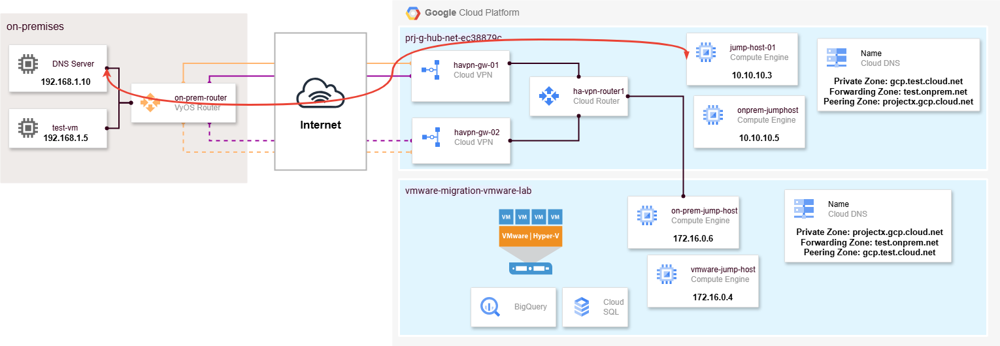

# **Project Name**

The goal is to connect the on-prem VyOS router to the GCP Virtual Private Cloud (VPC) using a VPN tunnel. After the VPN tunnel is established, BGP peering is configured to propagate routes between the two networks, enabling bidirectional communication between the on-prem network and the GCP VPC subnets.
This is the high level architecture of the use case: 

## Key Steps:
- Establish a VPN connection between the VyOS router and GCP using IPsec.
- Configure BGP peering between the VyOS router and GCP to exchange routing information.
- Advertise and accept routes between on-prem subnets and GCP subnets via BGP.
- Enable communication between on-prem systems and GCP services.

---

## Prerequisites
- A VyOS router deployed on-prem.
- Google Cloud Platform (GCP) project with a VPC network set up.
- Administrative access to both the VyOS router and GCP router configurations.
- IPsec VPN tunnel already established between VyOS and GCP.

---

## VyOS Router Configuration

1. Configure the IPsec VPN Tunnel
- Ensure that the VPN tunnel between VyOS and GCP is established and IPsec is properly configured. For this example, we use vti13 as the interface for BGP peering.

2. BGP Configuration on VyOS

- Set the BGP ASN for VyOS (e.g., 65502).
- Set the GCP's ASN (e.g., 65000).
- Configure the neighbor IP and password (if applicable).
- Use the vti13 interface for BGP peering.

Example Configuration:

- set protocols bgp 65502 neighbor 169.254.2.1 remote-as 65000
- set protocols bgp 65502 neighbor 169.254.2.1 update-source vti13
- set protocols bgp 65502 neighbor 169.254.2.1 passive
- set protocols bgp 65502 network 192.168.1.0/24