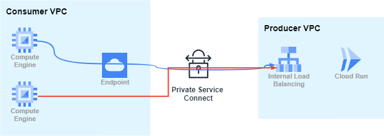

# Private Service Contrrols Use Case

🧩 Key Components:
PSC Endpoint (Consumer VPC): A private IP that allows internal services (e.g., VMs, GKE) to access the remote service.
Service Attachment (Producer VPC): Created by enabling PSC on an internal load balancer that fronts the Cloud Run service.

✅ Benefits:

🔒 Private & Secure – All traffic stays within Google's private network.

🚫 No Public IP Needed – Cloud Run remains unexposed to the internet.

🧱 Cross-Project / Cross-VPC – Seamless integration between teams or environments.

🧭 Centralized Control – The producer controls access to the service via the attachment.

🚨 Important: Enforced Private Path Only

As shown in the diagram:

🔵 The blue line shows the correct path: VM → PSC Endpoint → Internal Load Balancer → Cloud Run.

🔴 The red line demonstrates an invalid path: If the VM tries to reach Cloud Run without using the PSC endpoint, the traffic will be blocked.

➤ This ensures no unintended access paths are available, enhancing security.

🛠️ Real-World Scenario

A VM in Consumer VPC needs to call a Cloud Run service in Producer VPC.
The Cloud Run service is fronted by an internal HTTP(S) load balancer with a PSC-enabled service attachment.
The consumer creates a PSC endpoint bound to the service attachment.
Only requests sent through the PSC endpoint's private IP will reach Cloud Run successfully.
