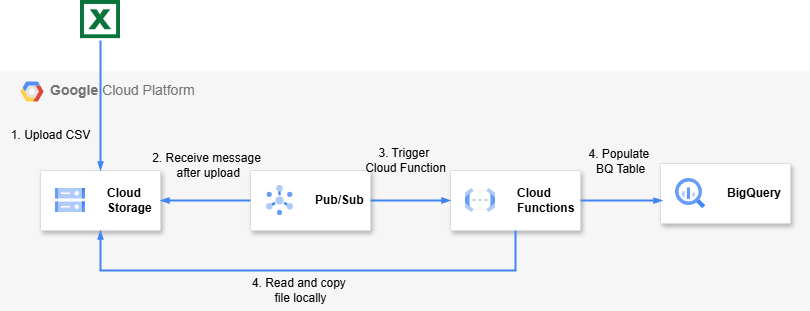

# GCS to BigQuery with Cloud Function and Pub/Sub

This project demonstrates how to automate the ingestion of CSV files from Google Cloud Storage (GCS) into BigQuery using **Cloud Functions** triggered by **Pub/Sub** notifications. It uses a decoupled event-driven architecture suitable for scalable data pipelines.

## 📌 Overview

**Architecture Components:**

- **GCS**: Stores uploaded CSV files.
- **Pub/Sub**: Listens for GCS object finalization events and triggers Cloud Function.
- **Cloud Function**: Parses the CSV and loads data into BigQuery.
- **BigQuery**: Stores structured data and enables analytics.

---

## ✅ Benefits of Using Pub/Sub (vs. Direct Trigger from GCS)

| Feature                          | GCS → Pub/Sub → Cloud Function | GCS → Cloud Function |
|----------------------------------|---------------------------------|-----------------------|
| **Asynchronous**                 | ✅                              | ❌                    |
| **Decoupled Architecture**       | ✅                              | ❌                    |
| **Event Retry Mechanism**        | ✅                              | ❌                    |
| **Scalable and Extensible**      | ✅                              | ❌                    |
| **Multiple Subscribers Supported**| ✅                              | ❌                    |

### 🔍 Key Advantages:
- **Asynchronous and decoupled**: Uploading files won't be blocked by function execution.
- **Reliable**: Pub/Sub ensures message delivery with retry logic.
- **Scalable**: Pub/Sub can handle millions of events per second.
- **Flexible**: Easily add more subscribers (e.g., for logging, alerts).

---

## ⚙️ Infrastructure Setup

### 🛠️ Prerequisites
- Google Cloud Project
- Terraform & gcloud CLI installed
- Enabled APIs:
  - Cloud Functions
  - Pub/Sub
  - BigQuery
  - Cloud Storage

---