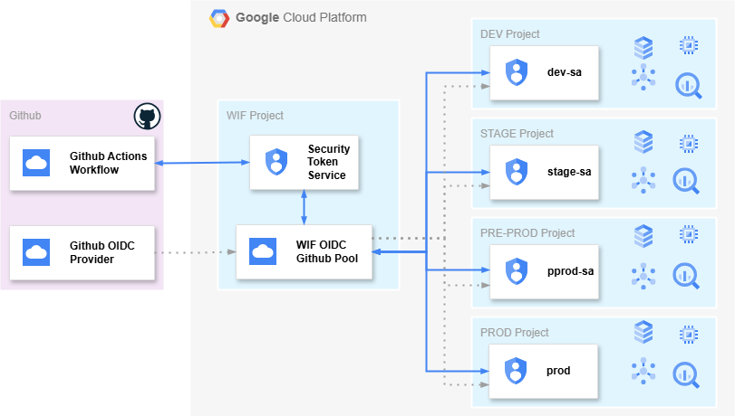

# GitHub Actions Deployment with Workload Identity Federation in GCP

This guide outlines how to set up **Workload Identity Federation** in Google Cloud Platform (GCP) using **GitHub Actions** to deploy to multiple environments (dev, stage, preprod, prod) with different service accounts for each environment.

## Prerequisites

Before you begin, ensure the following:
- You have access to a Google Cloud Platform (GCP) project with appropriate permissions.
- Your GitHub repository is set up with GitHub Actions.
- The Google Cloud SDK is installed on your local machine (for local testing, if needed).
- You have admin access to create IAM roles and service accounts in GCP.

## Architecture Overview

In this setup, we use a **single OIDC provider** in GCP linked to GitHub Actions to authenticate and deploy code to four different environments:
- **Dev**
- **Stage**
- **Preprod**
- **Prod**

Each environment has its own service account with the appropriate permissions.

## Steps

### 1. Set Up OIDC in GCP

First, create a single **OIDC provider** in your central GCP project for GitHub Actions.

1. Navigate to the **IAM & Admin** section in GCP Console.
2. Under **Identity & Organization**, choose **Workload Identity Federation**.
3. Click **Create Pool** and give it a name (e.g., `github-oidc-pool`).
4. Choose **GitHub** as the identity provider type and enter `https://token.actions.githubusercontent.com` as the audience.
5. Save and enable the OIDC provider.

### 2. Create Service Accounts for Each Environment

Create a **service account** for each environment:
- **Dev**: `dev-service-account`
- **Stage**: `stage-service-account`
- **Preprod**: `preprod-service-account`
- **Prod**: `prod-service-account`

For each service account, assign necessary roles such as `roles/compute.admin`, `roles/storage.admin`, `roles/appengine.deployer`, or other roles depending on the environment's needs.
